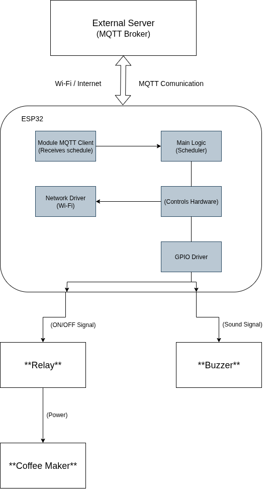

# Smart Coffee Maker

## 1. Architecture

## 2. Software

The firmware is developed using the **ESP-IDF**, the official development framework for the ESP32. The project is designed with a modular structure to separate responsibilities and improve maintainability.

Below is a description of each software module.

### Main (`main.c`)
This is the system's entry point and orchestrator. Its main responsibilities include:
* Initializing essential subsystems: NVS (Non-Volatile Storage), Wi-Fi, and MQTT.
* Implementing the main logic (state machine) upon waking from deep sleep.
* Checking the current time and the schedule to decide on an action:
    * Set a wake-up timer and enter deep sleep until the scheduled time.
    * Activate the relay to brew the coffee.
    * Handle expired or missing schedules.

### Wi-Fi Module (`wifi.c`, `wifi.h`)
This module is dedicated to managing network connectivity.
* Initializes the TCP/IP stack.
* Configures and connects the ESP32 to the specified Wi-Fi network.

### MQTT Module (`mqtt.c`, `mqtt.h`)
Manages all communication with the MQTT broker.
* Configures and initializes the MQTT client with the broker's address.
* Subscribes to the scheduling topic (`/cafeteira/agendar`) to receive commands.
* Processes incoming messages and forwards the payload to the Agenda module.

### Agenda Module (`agenda.c`, `agenda.h`)
Handles all time and scheduling logic.
* Synchronizes the ESP32's internal clock with an **NTP** server to get the correct date and time.
* Parses the schedule string received via MQTT (format: `"YYYY-MM-DD HH:MM"`).
* Saves and loads the schedule to/from **NVS** (Non-Volatile Storage), ensuring the data persists through deep sleep cycles.

### Control Module (`controle.c`, `controle.h`)
This is the hardware abstraction layer (HAL), responsible for direct interaction with peripherals.
* Contains functions to control the GPIO pins.
* Provides simple functions to turn the **relay** on/off and activate the **buzzer**.

## 3. Hardware

*(This section will be filled in later with component details and the wiring schematic.)*
